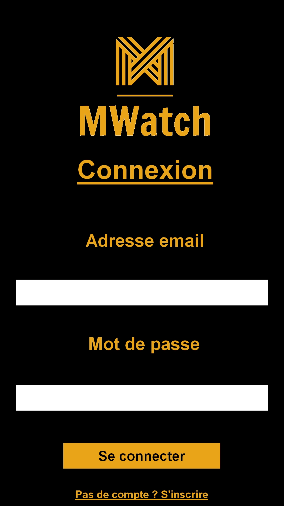
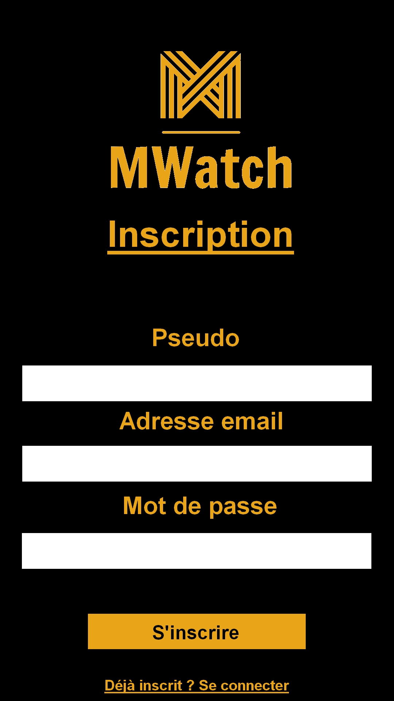
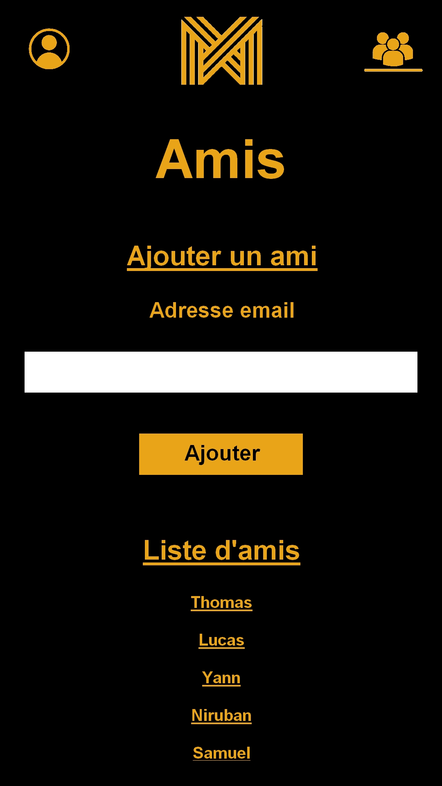
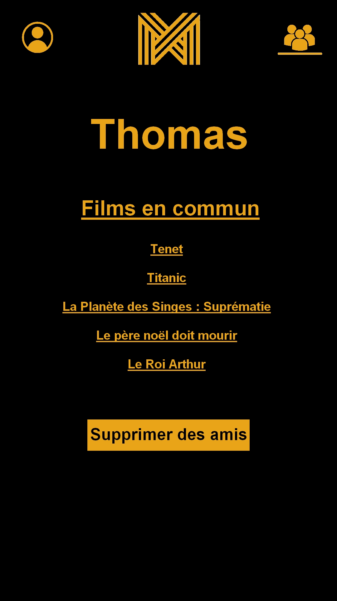
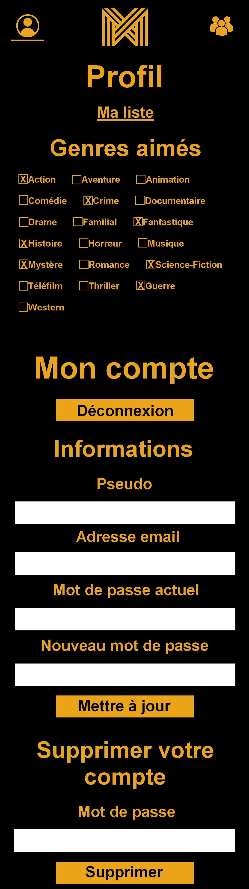
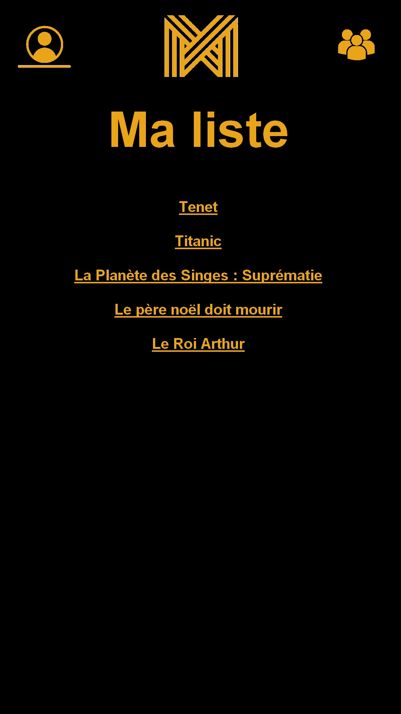
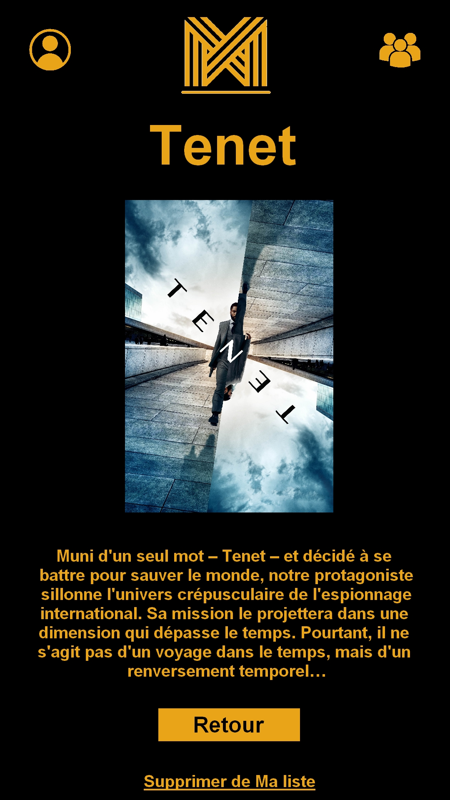

# Projet Mobile

Thomas Saudemont / Yann Roubeau / Samuel Lacasse / Lucas Guffroy / Niruban Thuraisingham

## Résumé du projet

L’application permet à des amis de trouver un film à regarder ensemble en fonction de leurs goûts.

### Démonstration

https://www.youtube.com/watch?v=vbhwEWEImbw&feature=youtu.be

### Navigation

#### Page connexion

#### Page inscription

#### Page swipe

Sur cette page (accessible depuis le menu) est proposé un film à l’utilisateur. Celui-ci peut alors indiquer s'il aimerait le regarder ou non, et s’il a déjà vu, indiquer s'il l'a aimé ou non. 

Ce choix est effectué via un swipe : 

- Swipe vers la droite : jamais vu et intéressé
- Swipe vers la gauche : jamais vu et non intéressé
- Swipe vers le haut : vu et aimé
- Swipe vers le bas : vu et non aimé

Il peut afficher les détails du film (titre, année, résumé) en cliquant sur l'affiche, et ajouter ce film à Ma liste en cochant un champ prévu à cet effet. Une fois le swipe effectué, un nouveau film est automatiquement proposé à l'utilisateur.

#### Page amis

Cette page (accessible depuis le menu) recense les demandes d'amitié reçues, et laisse le choix de les accepter ou de les refuser. Elle permet également à l’utilisateur d'envoyer des demandes d'amis en précisant l'email de l'utilisateur désiré. Enfin, l'utilisateur peut consulter la liste de tous les autres utilisateurs avec qui il est ami. Il peut cliquer sur un ami, et ouvre ainsi la page ami.

#### Page ami

L'utilisateur arrive sur cette page lorsqu'il clique sur un utilisateur dans sa liste d'amis. Il peut alors voir les films en commun qu'il a avec cet ami (les films qu'ils ont tous les deux aimés mais qu'ils n'ont pas vus). Il peut également supprimer cet utilisateur de ses amis en cliquant sur le bouton "Supprimer des amis".  En cliquant sur un film en commun, l'utilisateur peut ouvre la page film.

#### Page profil

Cette page (accessible depuis le menu) permet à l'utilisateur de définir ses genres de films favoris. Elle permet de même de mettre à jour ses informations personnelles (pseudo, email, mot de passe), de se déconnecter, de supprimer le compte, et enfin d'accéder à Ma liste.

#### Page Ma liste

La page Ma liste est accessible depuis le profil. Elle recense tous les films ajoutés à Ma liste lors du swipe. L'utilisateur ouvre la page film en cliquant sur un film.

#### Page film

La page film détaille le film précédemment cliqué (que ce soit sur la page ami ou la page Ma liste). Elle affiche de cette manière le titre du film, son année de production, son affiche, et son résumé. Si ce film a été ajouté à Ma liste, l'utilisateur se voit offrir la possibilité de le supprimer de Ma liste via un bouton conçu à cet effet. Un bouton retour renvoie sur la page précédente.

## Technologies utilisées

### Architecture

Modèle MVC + DAO en JavaScript via PhoneGap (Apache Cordova).

### Gesture

Swipe des films sur la page swipe.

### Données

- Utilisation de The Movie Database API (JSON)
- Stockage des données utilisateurs via Firestore

### Librairie

Librairie JavaScript: Vue.js

### Capteur

Accéléromètre : l’utilisateur peut swiper en agitant son téléphone.

## Livraisons

### LIVRAISON_GESTURE

https://github.com/cegepmatane/projet-mobile-2020-mwatch/tree/efe9c8879f39f2d409a30b450c4b1ddb4128f200/POCGesture

### LIVRAISON_DAO

https://github.com/cegepmatane/projet-mobile-2020-mwatch/blob/2448c22be9a1efe0bc79aa0f5eaf1cd82e95fab1/POCBackend/donnee/UtilisateurDAO.js

### LIVRAISON_VUES

https://github.com/cegepmatane/projet-mobile-2020-mwatch/tree/master/MWatch
 https://github.com/cegepmatane/projet-mobile-2020-mwatch/tree/master/ProjetMobile-Mwatch